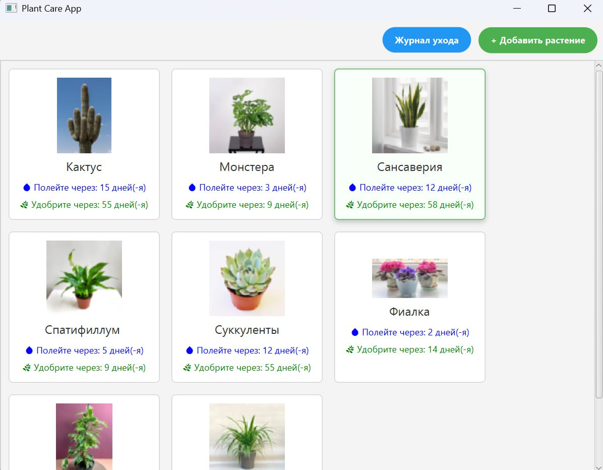
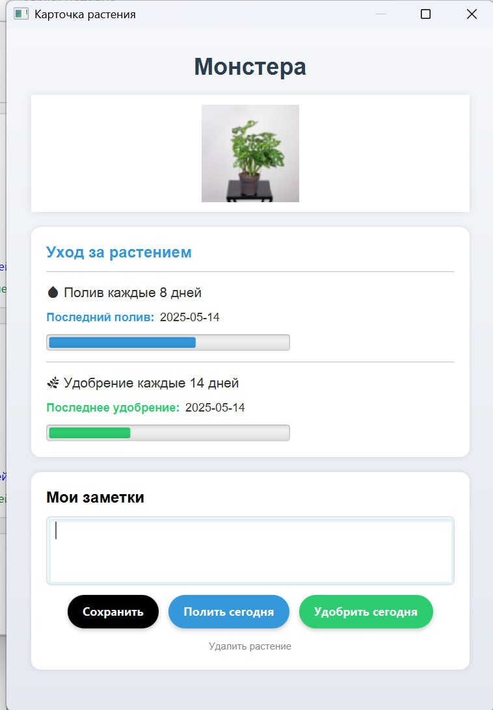
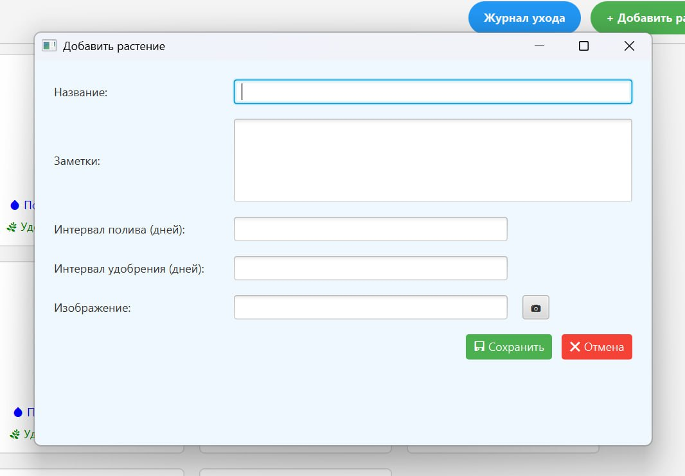
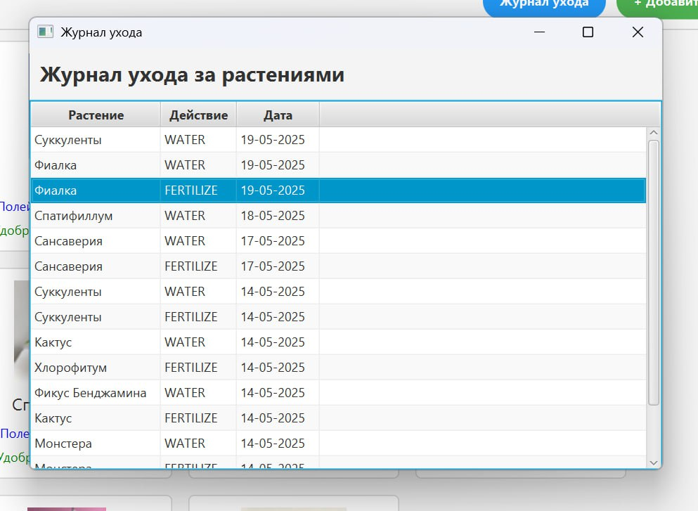

# Приложение по уходу за растениями
### Программа позволяет
- Вести учет своих растений, включая их названия, фотографии и информацию о необходимом уходе.
- Получать напоминания о поливе и удобрении растений.
- Сохранять заметки и историю ухода за каждым растением.
- Систематизировать процесс заботы о растениях, что особенно полезно для людей с большим количеством растений или ограниченным временем.

### Программа написана с помощью 
- Среда разработки: Apache NetBeans 22
- Язык разработки Java 17.0.0.1

### Используемые библиотеки
- SQLite 3.36.0.3
- JavaFX 21

## Внешний вид проекта
### Главная страница
 
 
Страница иллюстрирует все добавленные растения, напоминание о поливе и удобрении (цвет напоминания становится красным когда приближается срок полива). В правом верхнем углу расположены кнопки "Журнал ухода" и " + Добавить растение" светло-голубого и зеленого цвета соответственно. При нажатии на первую, откроется окно с журналом ухода, где будет видна история (полив и удобрение) действий с растениями. При нажатии на " + Добавить растение", откроется окно добавления растения. Также есть возможность просмотреть подробную информацию о растении, сделать отметку о поливе и удобрении, создать заметку, нажав на саму карточку растения.

### Подробно о растении
 
 
На данной странице отражена полная информация о конкретном растении. Можно сделать отметку о поливе, нажав на кнопку "Полить сегодня", об удобрении, нажав на кнопку "Удобрить сегодня". При желании добавить заметку, следует заполнить текстовое поле и нажать на кнопку "Сохранить". Есть возникнет потребность удалить растение - для этого есть соответствующий текст, доступный для нажатия, внизу окна. Прогрессионные шкалы светло-голубого и зеленого цвета указывают сколько времени осталось до следующего полива\удобрения, они меняют градиент цвета на красный когда приближается дата и время полива).

### Добавление растения
 

Окно предоставляет возможность заполнить карточку растения, введя все нужнеы параметры, а также добавить фотографию, которая будет отображаться на главной странице и в самой карточке растения.
 
### Журнал ухода
 

Журнал позволяет просматривать информацию о действиях по поливу и удобрению растений, включая дату.
